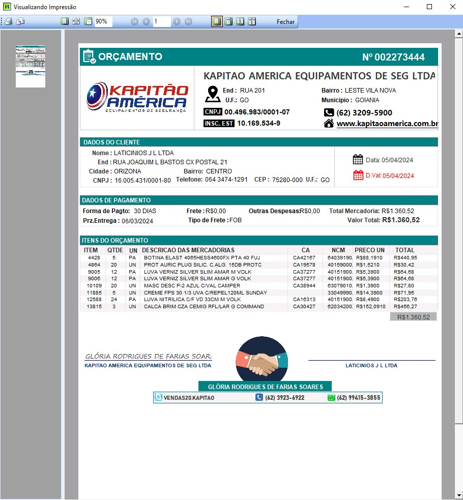
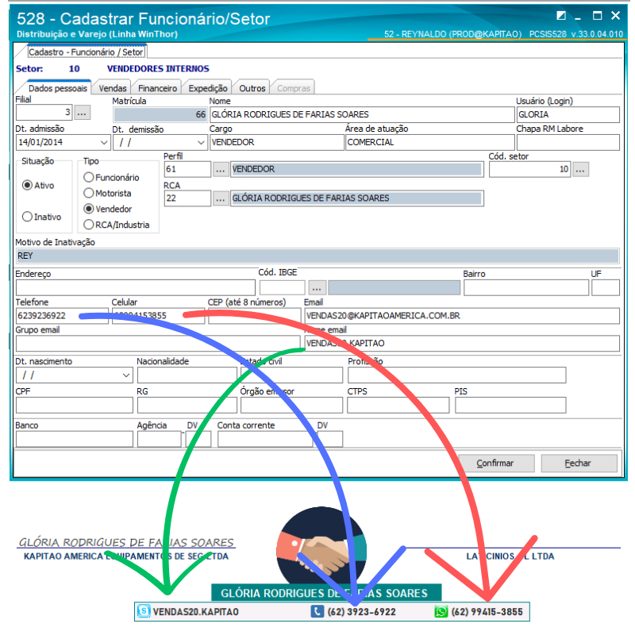
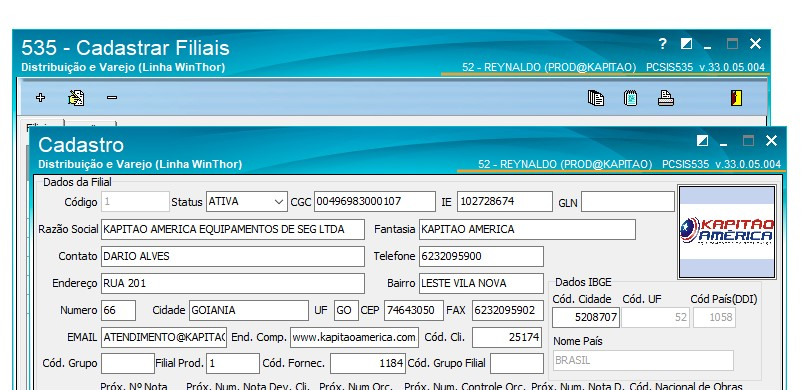

# 📝  Orçamento Customizado Para Winthor 

O orçamento gerado pelo Winthor através da rotina de vendas **316 - Digitar Pedido De Vendas** é básico e nada profissional.

 

### 💻 Pré-requisitos

Para configuarar a parte inferior do orçamento é necessário preencher os dados da rotina **528 - Cadastrar Funcionar/Setor** 

  

#### Adicionar a logo marca ao Orçamento
A logo marca da empresa deve ser adiciona na rotina **535 - Cadastrar Filiais**

  

#### Arquivos com o Layout e Sql
O arquivo **REL8036.RTM** tem o layout deste orçamento e o **REL8036.SQL** esta com a query para consultar no banco de dados.